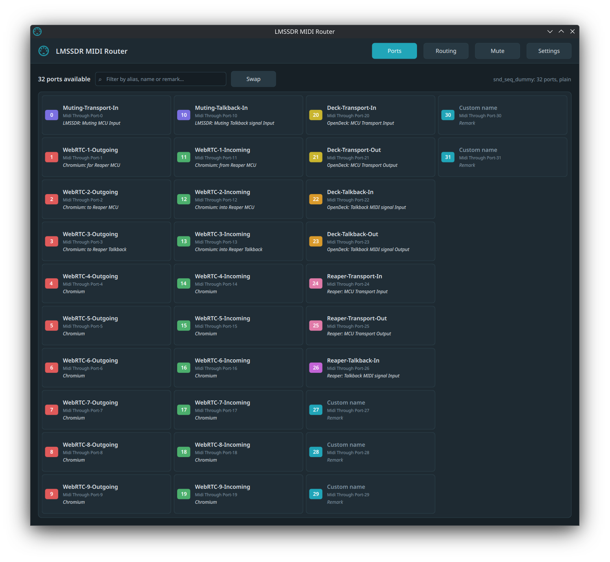
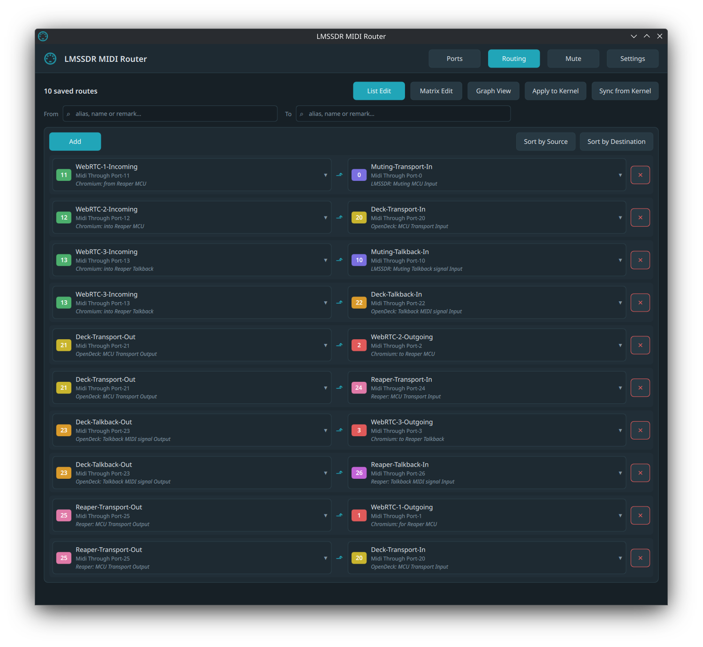
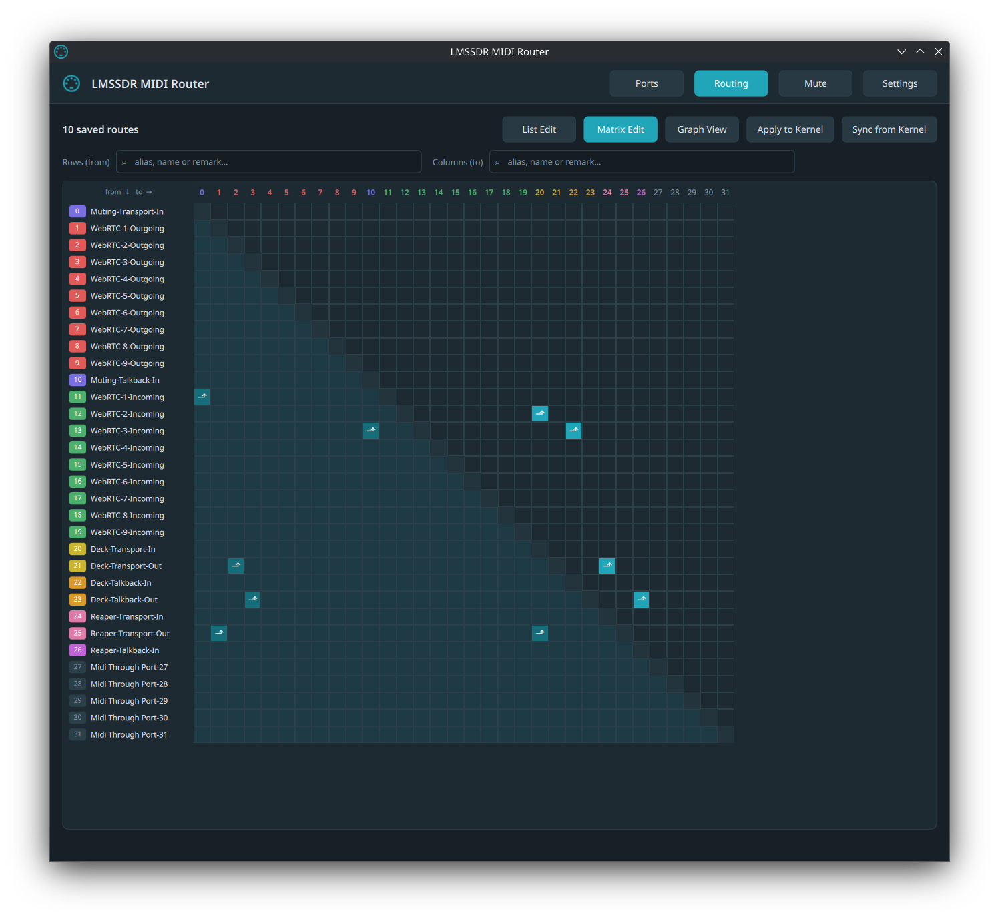
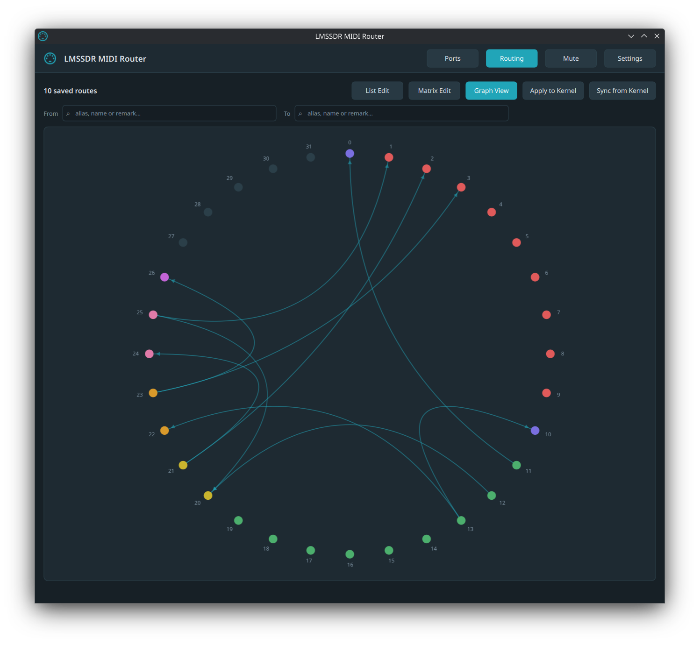
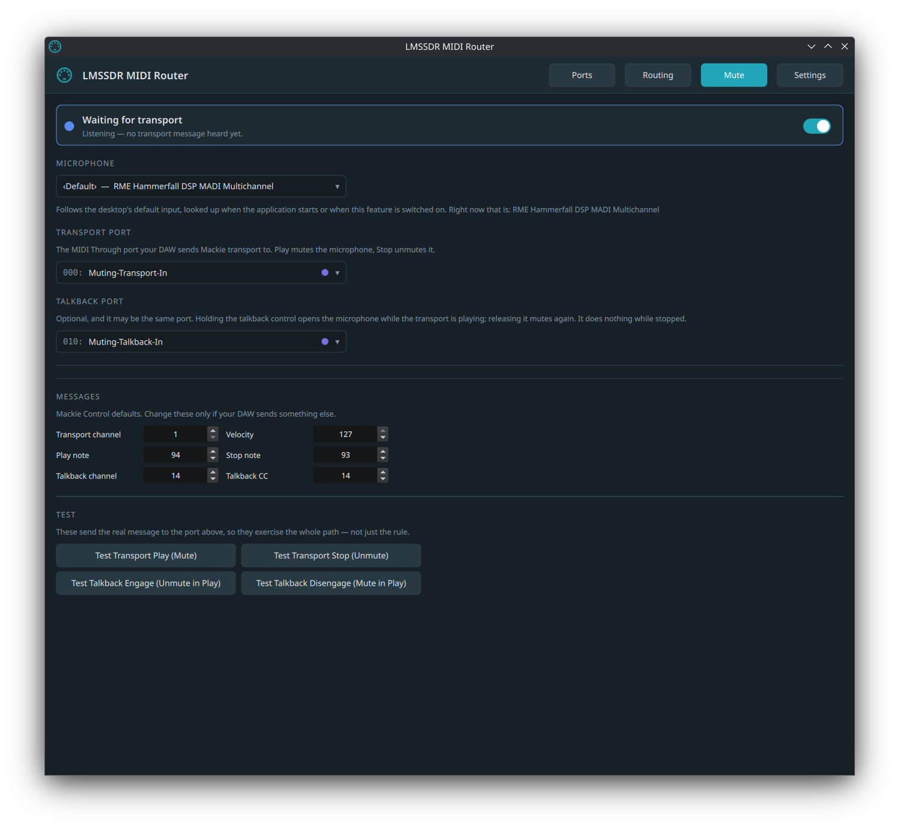
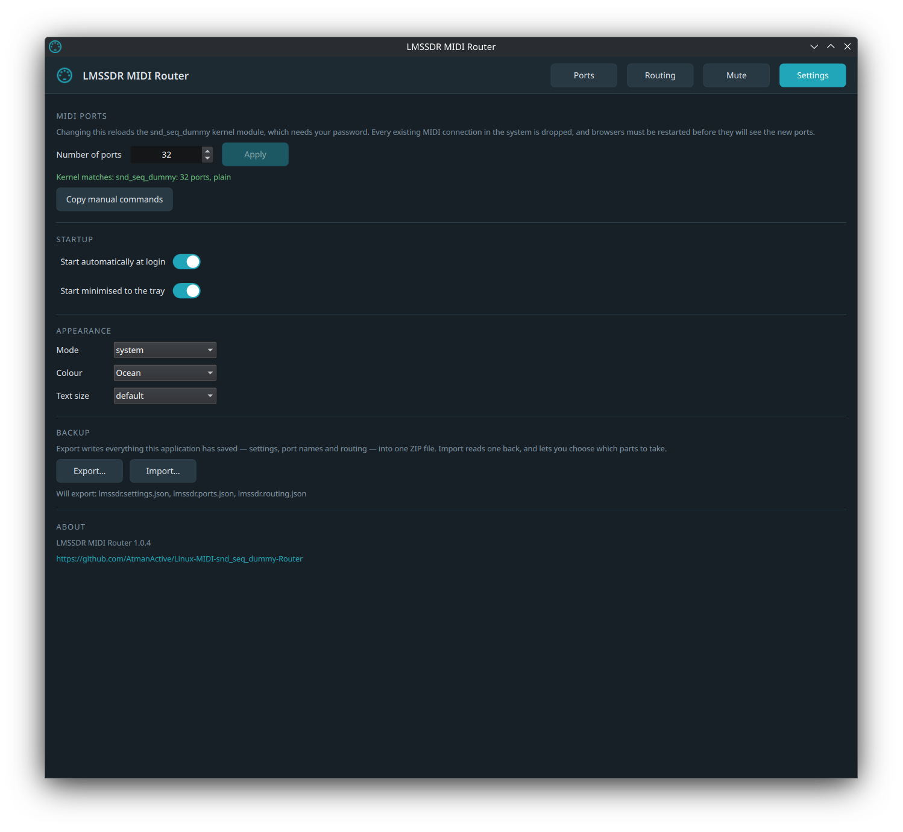

# Linux MIDI snd_seq_dummy Router

A desktop app that controls ALSA's [snd_seq_dummy](https://github.com/torvalds/linux/blob/master/sound/core/seq/seq_dummy.c) MIDI ports: how many there are, what you call them, and how they are wired to each other. 
Plus a MIDI-driven microphone mute/unmute by Mackie Control MIDI transport signals. 
Built for KDE Plasma on Wayland, tested on Debian 13.

## Why

Chromium's [Web MIDI](https://github.com/AtmanActive/webmidi-rtc-transport) on Linux only exposes sequencer ports whose ALSA client id is below 16. `snd_seq_dummy` takes the id 14; sound cards start at #16, while userspace virtual-cable tools (like Bome Network, a2jmidid, anything on rtmidi) land at #128 and above, invisible to browsers. [Reaper](https://reaper.fm) ignores userspace clients too.

So `snd_seq_dummy` is the one port source browsers and DAWs both agree on, but it is bare: a fixed port count chosen at module load, names hardcoded to `Midi Through Port-N`, and no way to rename them. 
This app comes as a helper to make the MIDI port management human friendly.

## Screenshots
<details>
  







</details>

## Install

Grab a build from [Releases](https://github.com/AtmanActive/Linux-MIDI-snd_seq_dummy-Router/releases):

```bash
sudo apt install ./lmssdr_*_all.deb          # Debian 13 / Ubuntu, ~200 kB
```

```bash
chmod +x lmssdr-*-x86_64.AppImage            # any other x86_64 Linux
./lmssdr-*-x86_64.AppImage
```

The `.deb` uses the system Qt and wires up icons, the desktop entry and the  
polkit helper for you. The AppImage bundles Python and Qt (~90 MB) and needs  
nothing installed, but cannot install the polkit helper. Polkit identifies a  
program by a fixed absolute path, and a mount point that changes every run is  
not one. Extract it and run the bundled installer if you want the port count  
to use KDE's password dialog:

```bash
./lmssdr-*-x86_64.AppImage --appimage-extract
sudo squashfs-root/usr/share/lmssdr/install-polkit.sh
```

Or from source:

```bash
uv venv && uv pip install -e .
./packaging/install-icons.sh           # tray icon colours
sudo ./packaging/install-polkit.sh     # optional, for the port count
lmssdr
```

**Icons** must be installed into an icon theme or the tray icon will not  
change colour. Plasma carries a themed icon by *name*, and an icon loaded  
from a file travels as pixmap data the shell may never refresh. Add  
`--system` to install for all users.

**polkit** lets the app ask for your password through KDE's normal dialog  
when changing the port count, which reloads a kernel module. Without it the  
app still works: `pkexec` falls back to a generic prompt, and failing that  
the app shows you the commands to paste. The helper is the only privileged  
code here.

## Usage

The app lives in the system tray and keeps running when you close the  
window. Offers four pages:

**Ports:** set an alias, a remark and a colour per port. The  
kernel name is always shown alongside, so you can still find the port in  
other applications. Filter by any of the three fields at once. **Swap**  
exchanges two ports' names, colours *and* routing in one gesture.

**Routing:** connect any port to any port. Three panels available: **Matrix Edit** (a  
grid, click a cell), **List Edit** (source → destination pairs), and **Graph  
View** to visualize the routes. **Apply to Kernel** makes the kernel match what is saved, removing anything else between dummy ports. **Sync from Kernel** does the reverse.

**Mute**: off by default. Point it at a microphone and at the port your DAW  
sends Mackie MIDI transport to:

| Message                                      | Effect                      |
| -------------------------------------------- | --------------------------- |
| note on, ch 1, note 94, vel 127 (**Play**)   | microphone muted            |
| note on, ch 1, note 93, vel 127 (**Stop**)   | microphone unmuted          |
| CC 14 on ch 14, value 127 / 0 (**talkback**) | holds it open while playing |

Every number is configurable. Test buttons on the page send the real  
messages, so they exercise the whole path.

Tray icon colours: **blue** listening but nothing heard yet, **red** muted,  
**purple** talkback engaged, **green** transport stopped. Quitting  
always unmutes the microphone back.

**Settings:** set a desired port count (default 32, kernel maximum 254), autostart,  
theme, and export/import of configuration data.

### Backup

**Export** writes everything to one ZIP. **Import** reads one back and asks  
which parts to take, so you can adopt saved port names without their  
routing, if so desired. Imported routing is re-applied to the kernel authoritatively;  
replaced files are kept alongside as `*.pre-import`. An imported port count  
is the one thing you must **Apply** yourself as it reloads a kernel module  
and needs your password.

You can find pre-populated settings exports in the [settings directory](tree/main/settings).

## Where your data lives

JSON under `~/.config/lmssdr`:

| File                   | Holds                                              |
| ---------------------- | -------------------------------------------------- |
| `lmssdr.settings.json` | port count, startup, appearance, mute rules        |
| `lmssdr.ports.json`    | aliases, remarks and colours, keyed by port number |
| `lmssdr.routing.json`  | saved routes, as port-number pairs                 |

Also `~/.config/autostart/lmssdr.desktop` when autostart is on, and  
`/etc/modprobe.d/lmssdr.conf`, written as root so the port count survives a  
reboot.

## How it behaves

- **Routing is a kernel subscription**, exactly like `aconnect` . The kernel  
  moves the bytes, so the app process can't interfere in the forwarding.
- **Ports are identified by number, never by address.** A module reload can  
  change the client id; port 7 stays port 7.
- **Nothing is deleted behind your back.** Lowering the port count hides  
  ports but keeps their names; routes whose ports are absent are skipped,  
  not forgotten.
- **Other applications' connections are never touched.** Subscriptions are  
  created and removed only where both ends are `snd_seq_dummy` ports.

## Development

````
.venv/bin/python -m pytest
````


License: GPL-3.0-or-later. Developed by AtmanActive.
